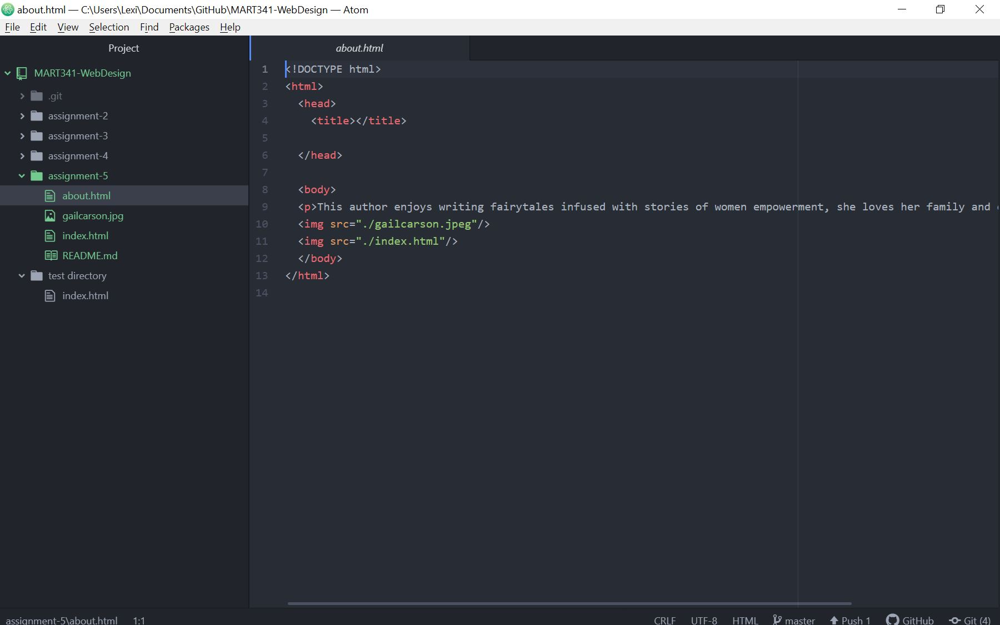

# Week 5 Response
1. For the first prompt I looked at MySpace 10 years ago, it was strange and gave me an 90's vibe, it took me way back. It definitely looked much less sophisticated and more basic. The graphics have changed, the text has more variety and a better layout.
2. I learned how to navigate HTML more effectively and was educated on using links and images in my work. What was difficult was wrapping my head around all the new tags.
3. 
